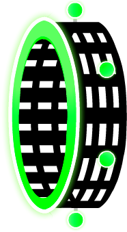
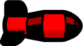
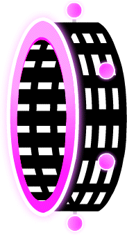
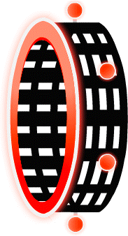
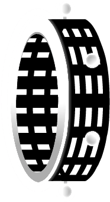
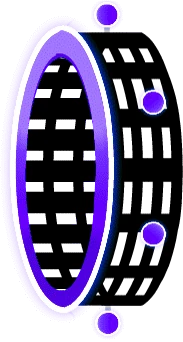
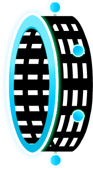
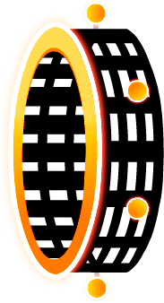
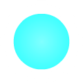

# Geometry Dash Mechanics

<b>Table of Contents</b>

- [Geometry Dash Mechanics](#geometry-dash-mechanics)
  - [1. Introduction](#1-introduction)
  - [2. Final game mechanics](#2-final-game-mechanics)
    - [2.1. Player](#21-player)
    - [2.2. Obstacles](#22-obstacles)
    - [2.3 Features](#23-features)
  - [3. MVP](#3-mvp)
    - [3.1. Only main mode](#31-only-main-mode)
    - [3.2. Start Point](#32-start-point)
    - [3.3.  Point](#33--point)
    - [3.4. White Square](#34-white-square)
    - [3.5. Screen Rolling](#35-screen-rolling)
    - [3.6. Ground](#36-ground)
    - [3.7. Jump](#37-jump)
    - [3.8. Death](#38-death)
    - [3.9. Black Box Obstacle](#39-black-box-obstacle)
  - [4. Future Improvements](#4-future-improvements)
    - [4.1. Player](#41-player)
    - [4.2. Game Mode](#42-game-mode)
    - [4.3. Bumper](#43-bumper)
    - [4.4. Orb](#44-orb)
    - [4.4. Level System](#44-level-system)

## 1. Introduction

In this document we will be discussing the mechanics of our remake of the game Geometry Dash.

## 2. Final game mechanics

### 2.1. Player

The player will be able to use multiple type of characters that behave differently. The player will be able to select through a variety of characters, colors, styles...

The original cosmetics are:

**Main character**

To enter another game mode, the player will have to go through portals that will transform the player into the character of the game mode.

**Ship:**

### 2.2. Obstacles

There will be different types of obstacles that the player will have to avoid. We will only do the black box obstacle and the spikes obstacle. The black box obstacle and spike will look like this:

 

### 2.3 Features

We plan to add coins that the player can collect to increase their score. The coins will look like this:

We also plan to add an attempt counter that will keep track of the number of times the player has died.

## 3. MVP

### 3.1. Only main mode

As a MVP only the main mode would be implemented. It consist in a die or retry mode.

### 3.2. Start Point

The game should have a start point where the player spawn at the launching of the game and every time he needs to respawn.

### 3.3.  Point

The game need a final point to end the level and close it.

### 3.4. White Square

The player would be represented as a white square since it will not contain any designed.

### 3.5. Screen Rolling

The screen will roll from left to right but it will not decomposed and composed the level when it appear in the screen, it will just roll as a band.

### 3.6. Ground

A ground will be implemented as well as a gravity system like in the original game.

### 3.7. Jump

The jump feature will be indispensable since it's a plateform game which need to avoid obstacles by jumping over them.

### 3.8. Death

In the case you hit an obstacle side-on for a square, you should die and restart the game at the start point.

### 3.9. Black Box Obstacle

The obstacle previously mentionned would only be black square for the mvp.

## 4. Future Improvements

### 4.1. Player

We will add new character types, that won't be playable in an early stage of the game, such as:

**Ball:**

**Robot:**

**Spider:**

**Wave:**

**UFO:**

**Color customization:**

The user will be able to choose within multiple available colors to customize the appearance of his character. A customization shop will be available to the user to do so.

### 4.2. Game Mode

Other game modes could be implemented in a breif delay. Two have already been thought.

**Practice Mode:**

For the Practice mode we would copy the same as the original one, adding checkpoint under cristal form. They would spawn every 2 clock cycles.
Two buttons will be added to create and remove a crystal.
If a checkpoint is set just before dying, it would be automatically removed.

**Infinity mode:**

This mode is the basic mode but you need to survive the longer you can. It will increment a score to add some competition.

### 4.3. Bumper

Some bumbers would be implemented, they basically make you jump automatically.

**Yellow:**

The yellow is the basic one, it makes you do a basic jump.

---

**Pink:**

The pink one would make you jump half a basic jump.

---

**Blue:**

The blue one wouldchange the gravity if you touch it.

---

### 4.4. Orb

Some Orbs would be implemented, they make you jump when you press the left click or thz space bare when you are on the sameposition as the orb.

**Yellow:**

The yellow is the basic one, it makes you do a basic jump.

---

**Pink:**

The pink one would make you jump half a basic jump.

---

**Blue:**

The blue one wouldchange the gravity if you touch it.

---

The blue one wouldchange the gravity if you touch it.

### 4.4. Level System

Some new levels would be regularly implemented with different difficulty level (Easy, Medium, Hard, Impossible).
The user would be able to choose which level he wants to play by scrolling the levels on the menu.
